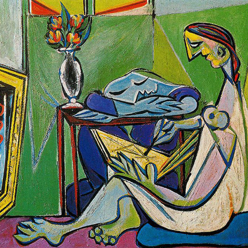

# Neural-Style-Transfer

## Theory
### Types :
- Optimization Based
- Feed Forward Based

### Concepts
- [Adam Optimizer](https://machinelearningmastery.com/adam-optimization-algorithm-for-deep-learning/#:~:text=Adam%20is%20a%20replacement%20optimization,sparse%20gradients%20on%20noisy%20problems.)
- [LBFGS Optimizer](https://machinelearningmastery.com/bfgs-optimization-in-python/)
- [Perceptual Loss](https://deepai.org/machine-learning-glossary-and-terms/perceptual-loss-function)
- [Instance Normalization](https://becominghuman.ai/all-about-normalization-6ea79e70894b)

## Results :

<table align="center">
    <tr>
        <th>Type</th>
        <th>Content Image</th>
        <th>Style Image</th>
        <th>Result </th>
    </tr>
    <tr>
        <td>Random-Optimization Based</td>
        <td></img></th>
        <td></img></th>
        <td></img></th>
    </tr>
    <tr>
        <td>Content-Optimization Based</td>
        <td></img></th>
        <td></img></th>
        <td></img></th>
    </tr>
    <tr>
        <td>Random-Optimization Based</td>
        <td></img></th>
        <td></img></th>
        <td></img></th>
    </tr>
    <tr>
        <td>Content-Optimization Based</td>
        <td></img></th>
        <td></img></th>
        <td></img></th>
    </tr>
</table>

## Todo
- [x] Optimization Based
- [ ] Feed Forward Based

## References :
### Paper :
1. [Origial Artistic Style NST Paper, arXiv, old](https://arxiv.org/abs/1508.06576)
2. [Orignal Artistic Style NST paper, CVPR, new](https://www.cv-foundation.org/openaccess/content_cvpr_2016/papers/Gatys_Image_Style_Transfer_CVPR_2016_paper.pdf)
3. [Perceptual Losses for Real-Time Style Transfer and Super-Resolution, arXiv](https://arxiv.org/abs/1603.08155)

### Blog  :
1. Image Stylization :
   * [Part 1](https://research.adobe.com/news/image-stylization-history-and-future/)
   * [Part 2](https://research.adobe.com/news/image-stylization-history-and-future-part-2/)
   * [Part 3](https://research.adobe.com/news/image-stylization-history-and-future-part-3/)
2. [Style Transfer Guide](https://www.fritz.ai/style-transfer/)

### Tutorial :
1. [Pytorch Tutorial](https://pytorch.org/tutorials/advanced/neural_style_tutorial.html)
2. [NST by The AI Epiphany](https://www.youtube.com/playlist?list=PLBoQnSflObcmbfshq9oNs41vODgXG-608)
3. [NST by Aladdin Persson](https://www.youtube.com/watch?v=imX4kSKDY7s)

### Code :
1. [kanlanc NST](https://github.com/kanlanc/Neural-Style-Tranfer)
2. [ProGamerGov NST](https://github.com/ProGamerGov/neural-style-pt)
3. [gordicaleksa NST](https://github.com/gordicaleksa/pytorch-neural-style-transfer)
4. [gordicaleksa NST Feed-Forward](https://github.com/gordicaleksa/pytorch-neural-style-transfer-johnson)

